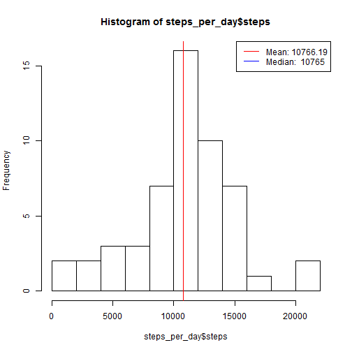
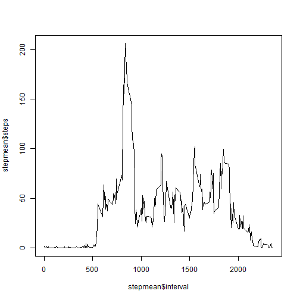
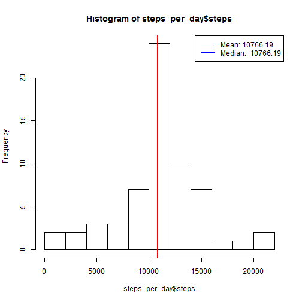

# Reproducible Research: Peer Assessment 1


## Loading and preprocessing the data

```r
activity <- read.csv("activity//activity.csv")

steps_per_day <- aggregate(steps ~ date, activity, sum)
```


## What is mean total number of steps taken per day?

```r
hist(steps_per_day$steps, 15)
abline(v = median(steps_per_day$steps), col = "blue")
abline(v = mean(steps_per_day$steps), col = "red")
legend("topright", lty = c(1, 1), col = c("red", "blue"), legend = c(paste(c("Mean:", 
    format(mean(steps_per_day$steps), nsmall = 2)), collapse = " "), paste("Median: ", 
    median(steps_per_day$steps))))
```

 

#### Mean and Mode (are present on the histogram)

```r
mean(steps_per_day$steps)
```

```
## [1] 10766
```

```r
median(steps_per_day$steps)
```

```
## [1] 10765
```

```r

```


## What is the average daily activity pattern?


```r
## average steps per 5 minutes intervals
stepmean <- aggregate(activity$steps, list(activity$interval), mean, na.rm = T)
names(stepmean) <- c("interval", "steps")
plot(stepmean$interval, stepmean$steps, type = "l")
```

 

```r


## interval contains the maximum number of steps:
stepmean[order(stepmean$steps), ][length(stepmean$steps), ]$interval
```

```
## [1] 835
```


## Imputing missing values
#### Count of NA rows

```r
sum(is.na(activity))
```

```
## [1] 2304
```


#### Replacement of the NA by the mean of the corres[ponding interval

```r
activity <- merge(activity, stepmean, by = "interval", suffixes = c("", ".y"))
naindexes <- is.na(activity$steps)
activity$steps[naindexes] <- activity$steps.y[naindexes]
activity <- activity[, c(1:3)]
```

#### Histogram of the repared data

```r
steps_per_day <- aggregate(steps ~ date, activity, sum)
hist(steps_per_day$steps, 15)
abline(v = median(steps_per_day$steps), col = "blue")
abline(v = mean(steps_per_day$steps), col = "red")
legend("topright", lty = c(1, 1), col = c("red", "blue"), legend = c(paste(c("Mean:", 
    format(mean(steps_per_day$steps), nsmall = 2)), collapse = " "), paste("Median: ", 
    format(median(steps_per_day$steps), nsmall = 2))))
```

 

#### Median has been moved to the mean value

## Are there differences in activity patterns between weekdays and weekends?

#### Convering date to Date format

```r
activity$date <- as.Date(activity$date)
```


#### function to parse the dates

```r
parsedate <- function(date) {
    if (weekdays(date) %in% c("Saturday", "Sunday")) {
        "weekend"
    } else {
        "weekday"
    }
}

#### add the new property
activity$day <- as.factor(sapply(activity$date, parsedate))
```

